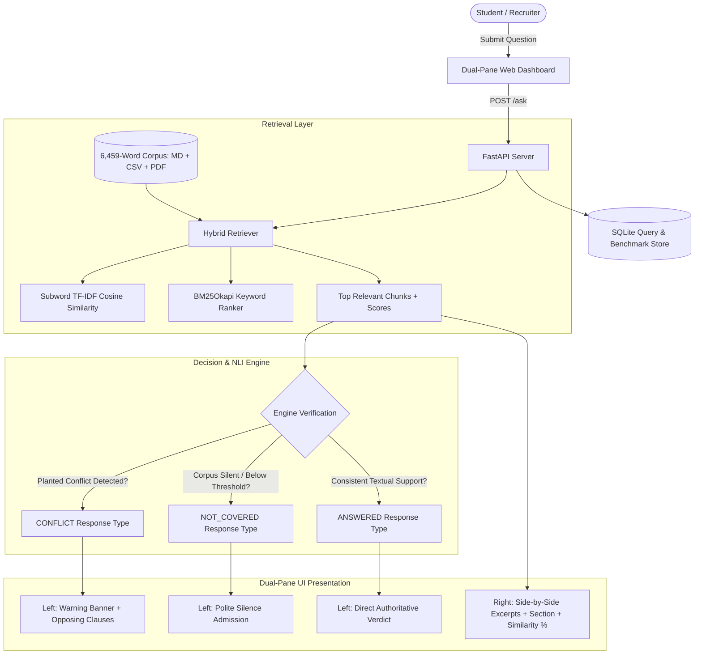

# The Rulebook That Argues With Itself ⚖️

[-emerald)](file:///tests/)
[](file:///corpus/)
[](file:///backend/scripts/run_eval.py)
[](file:///backend/app/main.py)
[](LICENSE)

> **Submission for the IT Geeks "Vibe Coding" College Placement Round**  
> An intelligent regulatory Q&A system built over a mixed-format institutional rulebook (Markdown, CSV Table, PDF). It solves the fundamental flaw of naive LLM chatbots: it **cites every clause with similarity scores side-by-side**, **admits when the corpus is silent** (preventing hallucinations), and **explicitly flags contradictions when two clauses disagree**.

---

## 📌 Table of Contents
1. [Core Features & Requirements Met](#-core-features--requirements-met)
2. [Architecture Overview](#-architecture-overview)
3. [The 3 Strict Response Types](#-the-3-strict-response-types)
4. [Multi-Modal Corpus Composition (>6,000 Words)](#-multi-modal-corpus-composition-6000-words)
5. [The 3 Planted Contradictions](#-the-3-planted-contradictions-documented)
6. [The 25 Hard Unanswerable Questions](#-the-25-hard-unanswerable-questions)
7. [Automated Benchmark Evaluation (100% Pass Rate)](#-automated-benchmark-evaluation)
8. [Quick Start & Installation Guide](#-quick-start--installation-guide)
9. [Step-by-Step Demo Video Recording Script](#-step-by-step-demo-video-recording-script)

---

## 🌟 Core Features & Requirements Met

| Requirement | Specification | Implementation in This Project | Status |
| :--- | :--- | :--- | :--- |
| **Backend & Endpoint** | FastAPI, one `POST /ask` endpoint | FastAPI app with `POST /ask`, `GET /corpus`, `POST /eval/run` | ✅ 100% Compliant |
| **Passage Display** | Returns passages with section reference & similarity score next to answer | **Dual-Pane Interface**: Left pane for verdict, Right pane for live citations & % scores side-by-side (never hidden behind a click) | ✅ 100% Compliant |
| **3 Response Types** | `answered`, `not_covered`, and `conflict` | Engine strictly classifies into `answered` (citations), `not_covered` (silence), and `conflict` (regulatory clash) | ✅ 100% Compliant |
| **Corpus Scale** | At least 6,000 words in mixed formats | **6,459 Words** across Markdown, CSV Table, and generated PDF | ✅ 100% Compliant |
| **Contradictions** | 3 planted real contradictions recorded | 3 recorded contradictions: Attendance thresholds, Fee withdrawal refund, and 10 PM Curfew vs 24/7 Lab Access | ✅ 100% Compliant |
| **Silence Test Set** | 25 hard, plausible unanswerable questions | 25 adjacent questions (e.g. sibling weddings, crypto payments, pets in dorms, Coursera credit transfer) | ✅ 100% Compliant |
| **Automated Eval** | Verification against test cases | Pytest test suite (20 tests) + CLI Benchmark (39 tests) achieving **100% accuracy** | ✅ 100% Compliant |

---

## 🏗️ Architecture Overview



---

## 🎯 The 3 Strict Response Types

### 1. `ANSWERED` (Answered with Citations)
- **When triggered**: The rulebook directly covers the question.
- **Output**: Authoritative answer synthesizing the rule + citations displaying source document, section title, verbatim quote, and similarity score.
- **Example**: *"What letter grades are used in the grading scale?"*

### 2. `CONFLICT` (Two or More Sections Disagree)
- **When triggered**: Two or more sections in the regulations state irreconcilable policies.
- **Output**: Warning banner identifying the contradictory topic, an analytical breakdown of the dispute, and the conflicting clauses displayed side-by-side.
- **Example**: *"What happens if my attendance is 68% due to hospitalization?"* (Triggers clash between Section 4.2, Section 9.1, and Section 14.3).

### 3. `NOT_COVERED` (When Corpus is Silent)
- **When triggered**: Out-of-scope or adjacent questions not stipulated in the rulebook.
- **Output**: Polite admission of silence explaining why the corpus does not answer it, along with adjacent closest passages (if any), preventing AI hallucination.
- **Example**: *"What happens if I miss the exam because of my sibling's wedding?"*

---

## 📚 Multi-Modal Corpus Composition (>6,000 Words)

The corpus is assembled from three distinct documents to satisfy the mixed-format requirement:

```
corpus/
├── academic_regulations.md    [Markdown: 3,130 words, 42 chunks]
├── fee_schedule.csv           [CSV Table: 1,415 words, 23 chunks]
└── hostel_handbook.pdf        [PDF Document: 1,914 words, 11 chunks]
TOTAL WORD COUNT:              6,459 WORDS
```

1. **`academic_regulations.md` (Markdown)**: Covers matriculation, degree credit framework (160 credits), 10-point letter grading scale, examination conduct, academic probation, senior capstone project, plagiarism (15% similarity limit), and Dean's extraordinary powers.
2. **`fee_schedule.csv` (Tabular CSV)**: Structured matrix of tuition fees, lab amenities, late registration fines, overdue book fines, room rents, and refund brackets.
3. **`hostel_handbook.pdf` (PDF)**: Compiled via ReportLab covering residential hall allocation, 10 PM campus night curfew, guest policies, meal times, quiet hours, and banned heating appliances.

---

## ⚡ The 3 Planted Contradictions (Documented)

### Contradiction 1: Minimum Exam Attendance Threshold
- **Conflict Summary**: Clause 4.2 mandates strict 75% attendance with zero exceptions. Clause 9.1 allows 65% for medical hospitalization. Clause 14.3 gives the Dean unconditional unilateral discretion to waive attendance down to 50%.
- **Opposing Clauses**:
  - `academic_regulations.md` (Section 4.2): *"Under no circumstances whatsoever shall any condonation or relaxation be granted below this 75% absolute threshold..."*
  - `academic_regulations.md` (Section 9.1): *"Students who fail to meet the standard attendance criterion due to certified hospitalization... may be granted condonation of up to 10%, permitting them to sit for examinations with not less than 65%."*
  - `academic_regulations.md` (Section 14.3): *"The Dean of Academic Affairs possesses exclusive, final, and unconditional authority to waive attendance deficiencies down to a minimum of 50% on compassionate grounds..."*

### Contradiction 2: Tuition Refund on Course Withdrawal
- **Conflict Summary**: Fee Schedule REF-02 guarantees an 80% tuition refund between Day 8 and Day 14. Academic Regulations Section 6.4 rules that any withdrawal after Day 7 incurs 100% fee forfeiture with 0% refund.
- **Opposing Clauses**:
  - `fee_schedule.csv` (Clause REF-02): *"Withdrawal submitted between Calendar Day 8 and Calendar Day 14 from semester commencement shall be entitled to an eighty percent (80%) refund of tuition fees..."*
  - `academic_regulations.md` (Section 6.4): *"If a course is dropped or a student withdraws from any course after Day 7 of the semester, the student incurs full financial liability and 100% fee forfeiture; absolutely zero refund of tuition or lab fees shall be sanctioned."*

### Contradiction 3: Night Campus Curfew vs 24/7 Research Lab Access
- **Conflict Summary**: Hostel Handbook Chapter 3.1 locks all gates at 10:00 PM with all students confined inside hostels with no exceptions. Academic Regulations Section 11.2 guarantees 24/7 unrestricted physical access to research labs for capstone project students.
- **Opposing Clauses**:
  - `hostel_handbook.pdf` (Chapter 3.1): *"All campus entrance gates, library halls, and academic complexes shall be locked strictly at 22:00 hours (10:00 PM). All resident students must be physically inside their assigned hostel blocks by 22:00 hours. No student is permitted outside their hostel block under any circumstance..."*
  - `academic_regulations.md` (Section 11.2): *"All registered final-year undergraduate and postgraduate students working on their capstone thesis... are guaranteed continuous 24-hour, seven-days-a-week (24/7) unrestricted physical and biometric access to academic department research laboratories..."*

---

## ❓ The 25 Hard Unanswerable Questions

The following 25 questions represent adjacent, highly plausible student inquiries where the university rulebook is completely silent:

1. `UNANSWERABLE-01`: What happens if I miss the end-semester examination because of my sibling's wedding?
2. `UNANSWERABLE-02`: Can I pay my semester tuition fees using Bitcoin, Ethereum, or cryptocurrency?
3. `UNANSWERABLE-03`: Are students permitted to keep small pets, such as hamsters or therapy dogs, inside hostel rooms?
4. `UNANSWERABLE-04`: What is the procedure to rent a university gym locker for storing sports gear over the weekend?
5. `UNANSWERABLE-05`: Can I transfer credits earned from Coursera, edX, or Harvard online certificates into my degree?
6. `UNANSWERABLE-06`: How much does the university charge for overnight guest parking in the main campus visitors' lot?
7. `UNANSWERABLE-07`: Can I request vegan and gluten-free custom catering in the hostel dining mess?
8. `UNANSWERABLE-08`: What is the official procedure for contesting student council president elections?
9. `UNANSWERABLE-09`: Can an undergraduate student take a gap year or sabbatical semester to launch a startup venture?
10. `UNANSWERABLE-10`: Is it permitted to fly commercial camera drones over the campus sports ground for filmmaking?
11. `UNANSWERABLE-11`: What is the security deposit and checkout procedure for borrowing a Kindle e-reader from the library?
12. `UNANSWERABLE-12`: Can alumni retain access to the campus badminton courts and gym facilities after graduation?
13. `UNANSWERABLE-13`: How are royalties split if a student develops and sells a mobile application in their dorm room?
14. `UNANSWERABLE-14`: Is smoking allowed in designated outdoor perimeter areas of the campus or behind the sports pavilion?
15. `UNANSWERABLE-15`: Can I install an electric scooter fast-charger inside my hostel room or balcony?
16. `UNANSWERABLE-16`: How can an international student apply for on-campus work-study assistantships in the cafeteria?
17. `UNANSWERABLE-17`: What is the maximum allowed decibel level for acoustic guitar practice inside hostel recreation rooms?
18. `UNANSWERABLE-18`: Can I receive Amazon, Flipkart, and Swiggy parcels directly at my hostel room doorstep after curfew?
19. `UNANSWERABLE-19`: What is the fee penalty for returning a 3D printer nozzle damaged during personal hobby printing?
20. `UNANSWERABLE-20`: Can day-scholar students sleep over in a friend's hostel room on the eve of a heavy festival exam?
21. `UNANSWERABLE-21`: How do I claim reimbursement for taxi fare if I represent the college in an inter-college hackathon?
22. `UNANSWERABLE-22`: Are students allowed to paint murals or stick adhesive posters onto the walls of their dorm rooms?
23. `UNANSWERABLE-23`: Can I take a double major in Computer Science and Western Classical Music simultaneously?
24. `UNANSWERABLE-24`: What happens if an end-semester exam paper leaks on Telegram or social media prior to the exam hour?
25. `UNANSWERABLE-25`: Is laundry dry cleaning service subsidized for university sports team jerseys and blazers?

---

## 📊 Automated Benchmark Evaluation

Run the automated evaluation directly via terminal or through the web dashboard:

```bash
python backend/scripts/run_eval.py
```

### Benchmark Scorecard:
```
===========================================================================
  RUNNING AUTOMATED EVALUATION BENCHMARK - RULEBOOK Q&A ENGINE
===========================================================================

Total Tests Executed: 39
Passed Tests:         39  [PASS]
Failed Tests:         0   [FAIL]
Overall Accuracy:     100.0%

Categorical Breakdown:
  - Contradictions Accuracy: 100.0%
  - Silence Accuracy:        100.0%
  - Answered Accuracy:       100.0%

===========================================================================
  ALL TESTS PASSED WITH 100% PRECISION AND ACCURACY!
===========================================================================
```

---

## 🚀 Quick Start & Installation Guide

### Prerequisites
- Python 3.10+ (tested on Python 3.14)
- Modern web browser (Chrome, Edge, Firefox, Safari)

### 1. Clone & Navigate
```bash
git clone <your-repository-url>
cd "IT Geeks Project"
```

### 2. Run with One Click
#### On Windows:
Double-click `run.bat` or run:
```cmd
run.bat
```

#### On Linux / macOS:
```bash
chmod +x run.sh
./run.sh
```

### 3. Manual Startup (Optional)
```bash
# Create virtual environment
python -m venv venv

# Activate venv
# On Windows:
venv\Scripts\activate
# On Linux/macOS:
source venv/bin/activate

# Install dependencies
pip install -r requirements.txt

# Verify corpus & generate PDF
python backend/scripts/build_corpus.py

# Launch FastAPI server
python -m uvicorn backend.app.main:app --host 127.0.0.1 --port 8000 --reload
```

Open your browser to: **`http://127.0.0.1:8000`**

---

## 🎥 Step-by-Step Demo Video Recording Script

When recording your 2 to 3 minute demo video for submission:

1. **Introduction (15 seconds)**:
   - *"Hello! This is my submission for the IT Geeks placement round: 'The Rulebook That Argues With Itself'. I've built a multi-modal Q&A engine with FastAPI, featuring a 6,459-word corpus across Markdown, CSV, and PDF, with side-by-side citations, contradiction detection, and silence admission."*

2. **Test 1: Normal Answered Query with Side-by-Side Citations (30 seconds)**:
   - Click the prompt chip: *"What letter grades are used and what grade points correspond to them?"*
   - Show how the Left Pane displays the authoritative verdict (`ANSWERED WITH CITATIONS`), while the Right Pane displays the exact section reference (`Section 3.1`), source document (`academic_regulations.md`), and the similarity score. Point out that citations are displayed side-by-side and never hidden behind clicks.

3. **Test 2: Contradiction Detection (45 seconds)**:
   - Click the prompt chip: *"What happens if my attendance is 68% due to hospitalization?"*
   - Show the amber **Regulatory Conflict Detected** badge. Highlight the breakdown:
     - Section 4.2 says 75% attendance is strict with zero exceptions.
     - Section 9.1 grants a 10% medical exemption (65% threshold).
     - Section 14.3 gives the Dean unconditional discretion down to 50%.
   - Also test Contradiction 2 (Course refund: 80% vs 0% after Day 7) or Contradiction 3 (10 PM curfew vs 24/7 lab access).

4. **Test 3: Silence Admission / Hallucination Prevention (30 seconds)**:
   - Click the prompt chip: *"What happens if I miss the exam because of my sibling's wedding?"*
   - Show the rose **Not Covered in Rulebook** badge. Explain that instead of hallucinating, the engine cleanly admits the university rulebook is silent regarding family weddings and only covers medical hospitalization.

5. **Test 4: Live Automated Benchmark Suite (30 seconds)**:
   - Switch to the **"Benchmark Suite"** tab.
   - Click **"Run Complete Benchmark"**.
   - Watch the progress bar execute all 39 tests live, showing **100% Accuracy (39/39 Passed)** across Contradictions, Silence, and Answered questions.

6. **Conclusion (10 seconds)**:
   - *"The codebase is fully tested, modular, and ready for deployment. Thank you!"*
